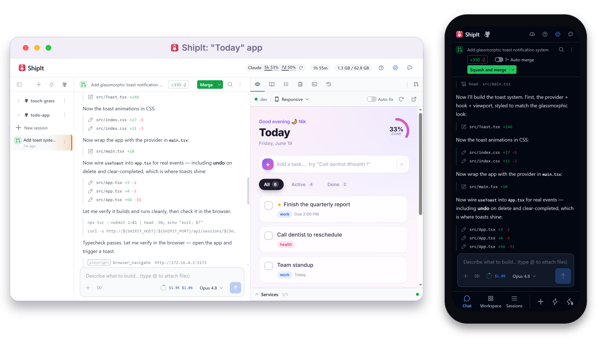

<h1 align="center">
  
  &nbsp;ShipIt
</h1>

**Describe products into existence — on your own Git, containers, and server.** Chat-driven
development that still ships the way real software does: branches, reviews, CI, and deploys.

<!-- TODO: hero screenshot or GIF — one frame showing chat + live preview + the inline PR card.
     Drop it at docs/assets/hero.png (or .gif for the describe → preview → PR loop) and uncomment:
<p align="center">
  
</p>
-->

ShipIt is a browser-based AI dev environment — describe what you want in chat, the agent writes the
code, and you see results live. It has the chat-driven ease of the prompt-to-app builders, but the
work runs through a real engineering loop — branches, pull requests, CI, deploys — on _your_ repo,
_your_ terminal, _your_ infrastructure. Where most AI coding tools stop at writing code, ShipIt is
built so you can just **ship**: it runs the isolated environments and live previews, drives the Git
and pull-request plumbing, and pulls CI and deploy results back into the chat — so you describe
products into existence instead of wiring up the infrastructure to support them. A few choices make
that possible:

- **Container-isolated sessions** — each session gets its own Docker container, branch, chat
  history, and workspace, so concurrent agents can't step on each other's files, processes, or
  installed dependencies. An agent can spawn its own follow-up sessions to fan work out in parallel.
- **Self-hostable on a VPS** — ShipIt is Docker-based end to end. Run it on a remote server and your
  laptop doesn't need to stay open for agents, previews, or CI follow-up work to continue.
- **Compose-based previews** — declare your dev server, databases, queues, log tailers, and other
  app services in `docker-compose.yml`; ShipIt manages them and surfaces automatic or manual
  previews inside the app.
- **Tight GitHub integration** — branches, auto-commits, pushes, PR creation, CI checks, deploy
  status, review comments, and merge state are rendered inline instead of punting you to GitHub.
- **Mobile-first, with first-class voice** — ShipIt is genuinely good from a phone, not a desktop
  tool that merely survives a small screen: a focused tab-based view on mobile and resizable split
  panels on desktop. Voice runs both ways — dictate prompts hands-free and hear spoken summaries
  when the agent finishes a turn or needs you, so you can kick off, review, and ship on the go.
- **One surface — you never leave it** — chat, file tree, terminal, live preview, diffs, CI logs,
  deploy status, session history, and the full PR lifecycle all render inline. Reviewing, shipping,
  and debugging happen here, not in a GitHub tab, a CI dashboard, or a local terminal.

That adds up to one promise: **everything you need to ship lives inside ShipIt.** You stay in the
conversation — describing intent, watching the result render live in the preview, and refining it
with the agent turn by turn — while it runs the commands, edits the files, reads the logs, opens
PRs, watches checks, and fixes failures. The build, review, ship, and debug loop never leaves the
chat.

## Why not just use the Claude or Codex app?

You probably already have Claude Code or Codex. ShipIt runs them as its backend — and wraps them in
everything the bare CLIs and their desktop/web apps leave out:

- **Many agents, fully isolated.** The CLIs run a single agent in your working tree. ShipIt gives
  every session its own container, branch, and chat history, so you fan work out in parallel without
  agents stepping on each other's files, processes, or installed dependencies.
- **It's not your laptop's problem.** The desktop and web apps tie the work to the machine in front
  of you. ShipIt is self-hosted on a VPS — start a change, close the lid, and previews, CI, and
  follow-up work keep running.
- **Real previews, not a throwaway sandbox.** ShipIt boots your actual Compose stack — dev server,
  database, queues — and renders the live app inline with HMR, instead of an environment you can't
  shape.
- **GitHub comes to you.** PRs, CI checks, review threads, diffs, and deploy status all render in
  the chat. The web apps send you off to a GitHub tab; ShipIt keeps the whole loop in one place.
- **Built for the phone.** Dictate a prompt, hear a spoken summary when the turn lands, review and
  merge one-handed. The official apps are desktop-first; ShipIt is genuinely usable from mobile.
- **Your tools stay familiar.** Git, a real terminal, file browsing, inline diffs — exposed, not
  hidden. You keep the control an engineer expects while the boring orchestration is automated away.

## Agents

Use the AI subscription you already pay for, or bring an API key. ShipIt has a pluggable agent
harness:

- [Claude Code CLI](https://docs.anthropic.com/en/docs/claude-code) — Claude Pro/Max subscription or
  an Anthropic API key
- [Codex CLI](https://github.com/openai/codex) — ChatGPT subscription or an OpenAI API key
- More to come — the backend is agent-agnostic by design, so new runtimes can slot in

## Installation

If you want to hack on ShipIt itself instead of just running it, see
[CONTRIBUTING.md](CONTRIBUTING.md) for the architecture, dev loop, and module layout.

### Prerequisites

- [Docker](https://docs.docker.com/get-docker/) with the Compose v2 plugin (`docker compose`).
  Docker Desktop bundles it; on Linux install `docker-compose-plugin` alongside `docker-ce`. ShipIt
  always runs containerized — there is no bare-metal mode.
- Credentials for at least one agent backend — a subscription or an API key works for either:
  - Claude Code: [Claude Pro/Max](https://claude.ai/upgrade) or an
    [Anthropic API key](https://console.anthropic.com/settings/keys)
  - Codex: a ChatGPT subscription or an [OpenAI API key](https://platform.openai.com/api-keys)

### Local (Docker)

```bash
git clone https://github.com/nicolasalt/shipit.git
cd shipit
docker/local/prod.sh
```

This builds the orchestrator + session-worker images and starts ShipIt with Docker Compose at
[http://localhost:4123](http://localhost:4123). On first run, ShipIt prompts you to authenticate
with the agent provider you've chosen via an OAuth flow in the browser. Credentials are stored in a
persistent Docker volume so you only need to do this once per provider.

### VPS

ShipIt ships with a one-command provisioning script for Ubuntu VPS hosts. It installs Docker, raises
the inotify limits session containers need, and optionally puts ShipIt behind a
[Cloudflare Tunnel](https://developers.cloudflare.com/cloudflare-one/connections/connect-networks/)
(with optional Zero Trust SSO) and/or exposes it over [Tailscale](https://tailscale.com/) — no open
inbound ports required.

**Recommended sizing:** 8 GB RAM minimum, 16 GB recommended. Each active session runs its own
container (agent CLI plus the session's Compose services — optional, but usually at least a dev
server), so headroom matters once you have a few sessions open at once.

```bash
ssh root@<server-ip>
bash <(curl -fsSL https://raw.githubusercontent.com/nicolasalt/shipit/main/deployment/vps/setup.sh)
```

The script asks whether you want Cloudflare, Tailscale, both, or neither, then takes care of
everything else: installing git and Docker, cloning ShipIt to `/opt/shipit`, configuring host
limits, building the images, installing the self-updater + restarter systemd units, and bringing
ShipIt up. Installing a fork instead? Set `SHIPIT_REPO_URL=https://github.com/you/shipit.git` before
the command.

Once it's running, updates happen from inside the UI — **Settings → Advanced → Software Updates** —
or via `bash /opt/shipit/deployment/vps/deploy.sh` on the host.

See [`deployment/README.md`](deployment/README.md) for the full guide: sizing recommendations,
Cloudflare Zero Trust access policies, wildcard preview DNS over Tailscale, and troubleshooting.

## Features

### Build

- **Chat-driven development** — the conversation is the only input you need; the agent plans the
  change, edits files, runs the commands, and reads the output, so you steer in chat instead of
  driving a shell
- **Existing subscription auth** — sign in with Claude Pro/Max or ChatGPT, or use Anthropic/OpenAI
  API keys when that fits your setup better
- **Agent-agnostic backend** — pick Claude Code CLI or Codex CLI per session; the backend boundary
  is designed for more agent runtimes over time
- **Compose-native live preview** — embedded iframes show your app updating in real time, with HMR
  proxied through ShipIt, multi-port support, and Docker Compose services managed per session
- **Project templates** — quick-start scaffolding for React, Vue, Next.js, Svelte, and more
- **File upload & image input** — drop files into the chat; the agent reads them as context
- **Interactive terminal** — full PTY (xterm.js) inside the session container for ad-hoc debugging
- **File viewer with diffs** — browse files with syntax highlighting and review changes as inline
  diffs
- **MCP integration** — connect Model Context Protocol servers to extend the agent's tools

### Review & ship

- **Inline PR lifecycle card** — title, description, CI checks, deploy status, and merge state all
  render in chat; no GitHub tab required
- **GitHub without leaving ShipIt** — create PRs, follow CI, read review threads, track deploys, and
  merge from the browser IDE
- **AI PR descriptions** — generated from the actual diff when you open a PR
- **Cross-agent review** — have a second agent review the first agent's changes before merging
- **Inline diffs** — file changes displayed as collapsible red/green diff blocks in the chat
- **Auto-deploy on push** — deploy status surfaces inline on the PR card via the GitHub Deployments
  API
- **PR comment sync** — review threads from GitHub appear inline in the conversation
- **Auto-fix failure loop** — preview crashes and CI failures are surfaced to the agent so it can
  inspect logs and fix them on the next turn

### Iterate safely

- **Git as undo** — every agent turn auto-commits; rewind to any previous state, and fork into a new
  branch from any point
- **Parallel PR-shaped sessions** — spawn separate workspaces with their own branch, container, and
  chat history; review each as its own PR
- **Container + worktree isolation** — multiple sessions on the same repo share a bare cache and use
  git worktrees, while each session's agent and services run in their own containerized environment
- **Permission modes** — choose how much autonomy the agent has per session
- **Live steering** — interrupt and redirect the agent mid-turn without losing context
- **Session sidebar** — pinned sessions, AI-generated session names, status indicators

### Everywhere

- **Mobile-first layout** — a focused tab-based view on small screens, resizable split panels on
  desktop; built and polished for real day-to-day use from a phone
- **Voice in and out** — dictate prompts with a mobile-friendly voice-recording overlay, and get
  spoken summaries when the agent finishes a turn or needs your input, so you can work hands-free
- **Background notifications** — tab title change and browser notification when the agent finishes
- **Self-update from UI** — pull the latest code, rebuild, and restart from Settings → Advanced

## Contributing

ShipIt isn't accepting pull requests right now — if you have a bug report, idea, or feature request,
please [open an issue](https://github.com/nicolasalt/shipit/issues). For the architecture, dev loop,
and module layout, see [CONTRIBUTING.md](CONTRIBUTING.md).

Found a security vulnerability? Don't open a public issue — follow [SECURITY.md](SECURITY.md).

## License

Apache 2.0 — see [LICENSE](LICENSE) for details. ShipIt is open-core: contributions are accepted
under a [Contributor License Agreement](CLA.md) so they can also ship in the proprietary enterprise
edition.
