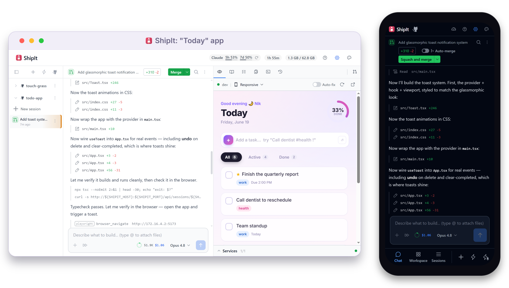

<h1 align="center">
  
  <span>&nbsp;ShipIt</span>
</h1>

<p align="center">
  <a href="https://github.com/nikzlabs/shipit/actions/workflows/ci.yml"></a>
  
  
  
</p>

<p align="center">
  
</p>

<!-- TODO: 60-second demo video / live demo link. Installing means building Docker images, so a video
     lets people evaluate ShipIt before they spend that. Host it
     (YouTube/Loom/asciinema or an mp4 in docs/assets/) and link it here as a "▶ Watch the demo" line
     or a clickable thumbnail right under the hero image. -->

ShipIt is a browser-based, chat-driven IDE for running coding agents through your **real engineering
loop**.

- **Parallel sessions in isolated containers** — run many agents at once, each with its own branch
  and workspace, so nothing they do collides.
- **Web/Android preview per session** — every session runs its own instance of your full app stack,
  so the agent can build, run, and fix before you preview and merge.
- **Bring your own agent** — on the subscription or API key you already have (Anthropic, OpenAI,
  DeepSeek, OpenRouter, etc.).
  - Supported harnesses: Claude Code and Codex, with OpenCode and Cursor CLI support coming.
- **The GitHub loop, inline** — work with PRs, CI, deploys, reviews, and issues, without leaving ShipIt.
- **Runs on Linux, macOS, and Windows (WSL2)** — in isolated Docker containers.
- **Ship from your phone** — mobile-first, with voice.

## Quickstart

### What you need

- [Docker](https://docs.docker.com/get-docker/) with the Compose v2 plugin (`docker compose`).
  Docker Desktop bundles it; on Linux install `docker-compose-plugin` alongside `docker-ce`.
- Credentials for at least one provider:
  - **Subscriptions** — [Claude Pro/Max](https://claude.ai/upgrade), ChatGPT, or a GLM (Z.ai)
    coding plan
  - **API keys** — [Anthropic](https://console.anthropic.com/settings/keys),
    [OpenAI](https://platform.openai.com/api-keys), DeepSeek, GLM (Z.ai), OpenRouter, or Vercel AI
    Gateway

### Run locally

Run ShipIt on your own machine — Linux, macOS, or Windows via
[WSL2](https://learn.microsoft.com/windows/wsl/install). This is a full install rather than a trial
mode: same sessions, same previews, same PR loop as on a server. What it can't do is keep working
while your machine is asleep.

```bash
bash <(curl -fsSL https://raw.githubusercontent.com/nikzlabs/shipit/stable/deployment/local/setup.sh)
```

This installs ShipIt under `~/.shipit`, builds the Docker images, and starts it **detached** at
[http://localhost:4123](http://localhost:4123). Connect a provider account once from the in-app
sign-in flow. Fork installs, custom paths, updates, and stop/uninstall are in
[`deployment/README.md`](deployment/README.md).

#### Reaching a local install from your phone

A local install binds to `127.0.0.1`, so it is not reachable from other devices — deliberately, since
ShipIt has no built-in authentication. To reach it from a phone or another machine over
[Tailscale](https://tailscale.com/), run:

```bash
~/.shipit/deployment/local/tailscale.sh
```

That adds a tailnet binding **alongside** loopback (localhost keeps working, and ShipIt still starts
when Tailscale is down) and prints a URL of the form `http://100-x-y-z.sslip.io:4123`.

Use that URL rather than the raw `http://100.x.y.z:4123`. Previews are served at
`{sessionId}--{port}.<host>`, and a raw IP address can't carry a wildcard subdomain, so previews are
blank on the raw-IP URL — [sslip.io](https://sslip.io) maps the dashed form straight back to the same
address, which makes them resolve with no DNS setup. Traffic rides the encrypted tailnet, but the
connection is HTTP: there is no wildcard certificate for these names, so clipboard access and PWA
install (which need a secure context) are unavailable. Getting real HTTPS means terminating TLS
yourself — a wildcard DNS record you own pointed at the tailnet address, a wildcard certificate for it,
and a reverse proxy in front of ShipIt; the DNS record alone is not enough. Details in
[`docs/254`](docs/254-local-bind-and-tailnet-access/plan.md).

To expose ShipIt on your LAN instead, set `SHIPIT_BIND_ADDR=0.0.0.0` in `~/.shipit/.shipit.env` — but
note that this puts an agent with a shell and your repositories on that network with nothing in front
of it, so only do it on a network you control. A host firewall is not a reliable substitute: on Linux,
Docker's published-port rules bypass `ufw`, and on macOS the application firewall is off by default.

### Run on a VPS

Pick this when you want ShipIt always on: agents, previews, and CI follow-up work keep running with
your laptop closed, and you pick the session back up from any device. Uptime is the only difference —
the product is the same either way.

ShipIt ships with a one-command provisioning script for Ubuntu hosts. It installs Docker, raises the
inotify limits sessions need, and can put ShipIt behind a
[Cloudflare Tunnel](https://developers.cloudflare.com/cloudflare-one/connections/connect-networks/)
(with Zero Trust SSO) or [Tailscale](https://tailscale.com/) — no open inbound ports. Plan for 8 GB
RAM minimum (16 GB recommended), since each active session runs its own container. Run it as root
(`sudo` is a no-op if you already are):

```bash
sudo bash -c "$(curl -fsSL https://raw.githubusercontent.com/nikzlabs/shipit/stable/deployment/vps/setup.sh)"
```

It asks which access path you want, then handles the rest — Docker, clone, host limits, image builds,
and the self-update systemd units. Updates land from the UI (**Settings → Advanced → Software
Updates**). Fork installs, host-side updates, sizing, access policies, and troubleshooting are all in
[`deployment/README.md`](deployment/README.md).

### After first boot

1. Connect GitHub so ShipIt can clone repos, push branches, open PRs, and read CI status.
2. Pick the harness (Claude Code or Codex) and the account it runs on.
3. Start a session from an existing repository, or create a new project from a template.
4. Describe the change you want; ShipIt creates an isolated container, branch, chat history, and
   workspace for that session.

## Status

ShipIt is in an early public release state, with two supported install paths — local Docker and a
Docker install on an Ubuntu VPS (see [Quickstart](#quickstart) for both). The core loop
is live: create isolated sessions, work against your repositories, run Compose-backed previews, open
PRs, track CI and deploy status from GitHub, and continue from desktop or mobile.

The project is public source, but not yet open to outside pull requests. Bug reports, feature
requests, and design discussion are welcome as GitHub issues.

## Why ShipIt exists

Coding agents are the easy part — you already have Claude Code or Codex. The hard part is everything
around them: an isolated environment per agent, a live app to test against, parallel work that doesn't
collide, and the full PR → CI → deploy → review loop on your repos. ShipIt is the surface that ties
all of that together, so you build, review, and ship in one place instead of stitching it together
yourself.

## Agents

Two separate choices — the harness that runs, and the account that pays for it:

- **Harness** — [Claude Code CLI](https://docs.anthropic.com/en/docs/claude-code) and
  [Codex CLI](https://github.com/openai/codex) today; OpenCode and Cursor CLI are coming, and the
  backend is agent-agnostic by design, so new runtimes can slot in
- **Provider** — Anthropic and OpenAI on a subscription or an API key, plus DeepSeek, GLM (Z.ai),
  OpenRouter, and Vercel AI Gateway on an API key

The two are largely independent: a model that speaks both an Anthropic-messages and an OpenAI style —
DeepSeek, GLM, most of what OpenRouter and Vercel front — runs on either harness. Connect more than
one account per provider.

**Smooth support for multiple subscriptions.** ShipIt moves to your next account before a usage limit
stops you, without interrupting sessions already in flight.

## Features

- **Build** — chat-driven edits, Compose-native live preview with HMR, services the agent starts and
  tails itself, Android builds and snapshot tests, an interactive terminal, and MCP servers.
- **Plan & track** — Linear and GitHub Issues in one list, a session started straight from an issue,
  and requirements written down before any code.
- **Review & ship** — an inline PR card carrying CI, deploys, and review threads; AI descriptions and
  reviews; automatic follow-up when checks fail, a preview crashes, or the base moves on.
- **Iterate safely** — every turn auto-commits so git is your undo, parallel sessions never share
  state, and destructive git is replaced with brokered, recorded operations.
- **Everywhere** — mobile-first and installable, with voice in and out and a global quick-capture
  hotkey.

**[See the full feature list →](FEATURES.md)**

## Known limitations

- ShipIt is a single-tenant tool you run yourself, with no built-in authentication today. If you
  expose it on the internet, put it behind Cloudflare Zero Trust, Tailscale, or another access layer
  you control; the VPS install script can help configure Cloudflare Tunnel/Zero Trust and Tailscale
  during setup.
- Expect meaningful Docker resource use: local production startup rebuilds ShipIt images, and each
  active session runs an agent container plus any Compose services your project declares. Session
  containers are sized automatically from the host's capacity, so there's normally nothing to tune —
  but a small host means fewer sessions can be active at once.
- The VPS installer targets Ubuntu. Other Linux distributions may work, but the one-command setup
  script is tuned for Ubuntu hosts.
- The full review-and-ship loop depends on GitHub. You can work locally without it, but PRs, CI,
  review threads, merge controls, and deploy status require GitHub auth and a GitHub remote.
- Deploy status is read from the GitHub Deployments API. It appears when your hosting provider
  creates GitHub deployments for pushed commits.
- Voice input and spoken summaries require configuring a supported voice provider for speech
  services.

## Security

ShipIt runs AI-agent-written code on your repos and infrastructure, so it treats the agent as a
powerful but only semi-trusted actor. The headline defenses:

- **Container-isolated agents** — each session runs in its own container on an isolated network, as
  an unprivileged user with no Docker socket, so a prompt-injected command has a small blast radius.
- **Built-in per-agent firewall** — outbound traffic is default-deny, restricted to an allowlist
  (agent API, your git host, registries, your MCP servers) and fail-closed, so by default a
  compromised agent has no network path out to exfiltrate your credentials.
- **Brokered credentials** — GitHub and tracker tokens are handed out on demand, not stored at rest
  inside the session container; with a GitHub App, git uses short-lived, single-repo-scoped tokens.
- **Session-scoped control plane** — each session worker's HTTP surface is authenticated, so a
  compromised agent can drive its own container and not its neighbors'.
- **Commit-time secret scanning** — the post-turn auto-commit blocks commits that would introduce a
  recognized credential, keeping known secret leaks out of your history.

Plus a repo trust gate, supply-chain version pinning, bug-report secret redaction, and Cloudflare
Zero Trust / Tailscale access control. The full picture — trust model, every defense, and accepted
limitations — is in [SECURITY-MODEL.md](SECURITY-MODEL.md).

## Contributing

ShipIt isn't accepting pull requests right now — if you have a bug report, idea, or feature request,
please [open an issue](https://github.com/nikzlabs/shipit/issues). For the architecture, dev loop,
and module layout, see [CONTRIBUTING.md](CONTRIBUTING.md).

Found a security vulnerability? Don't open a public issue — follow [SECURITY.md](SECURITY.md). For
how ShipIt defends its trust boundaries (and the risks it has accepted), see
[SECURITY-MODEL.md](SECURITY-MODEL.md).

## Website

[ship-it.ai](https://ship-it.ai/) — the product page.

## Author

Built and maintained by Nik Zherebtsov — [LinkedIn](https://www.linkedin.com/in/nikolayz/) ·
[GitHub](https://github.com/nicolasalt)

## License

Apache 2.0 — see [LICENSE](LICENSE) for details. ShipIt is open-core; when the project opens to
outside pull requests, contributions will require a [Contributor License Agreement](CLA.md) so they
can also ship in the proprietary enterprise edition.
